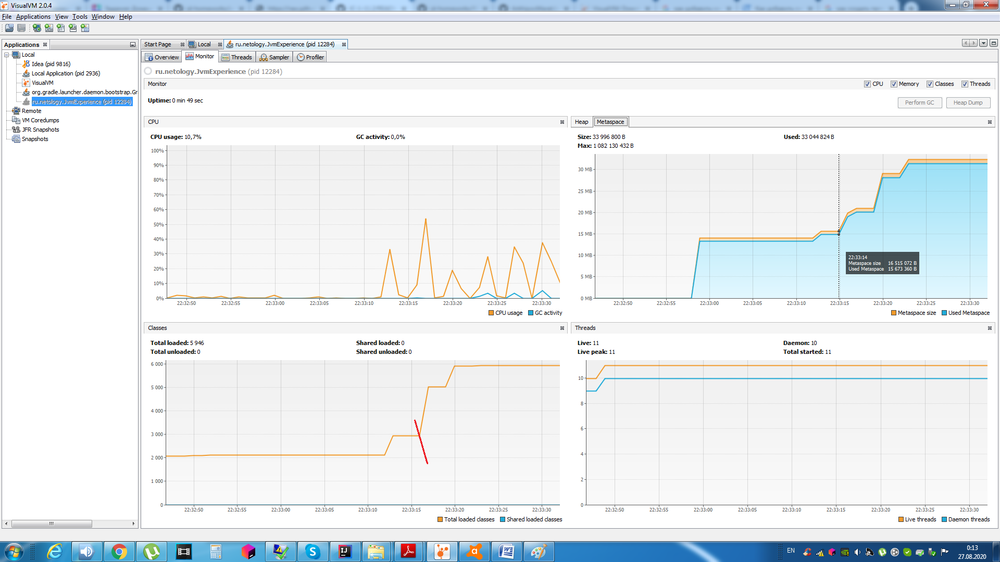
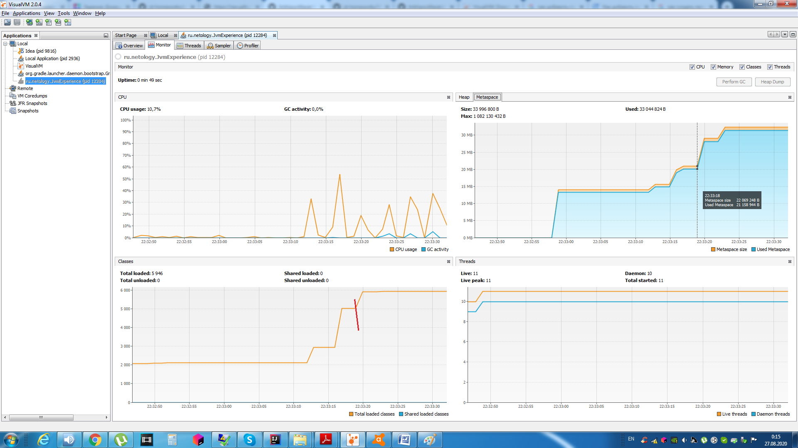

# Описание процесса работы программы
	
## 1 часть 
	
> программа загружает новые классы библиотек! - io.vertx, io.netty, org.springframework
	
22:33:12.346672900:  - loading io.vertx
_: loaded 529 classes_

	
22:33:15.726866200: loading io.netty
_: loaded 2117 classes_

	
22:33:19.545084600: loading org.springframework
_: loaded 869 classes_

	
_при подгрузке новых классов в Metaspace записываются мета-данные данных классов_
_используется область пямяти Metaspace, Heap пока не заполняется._
