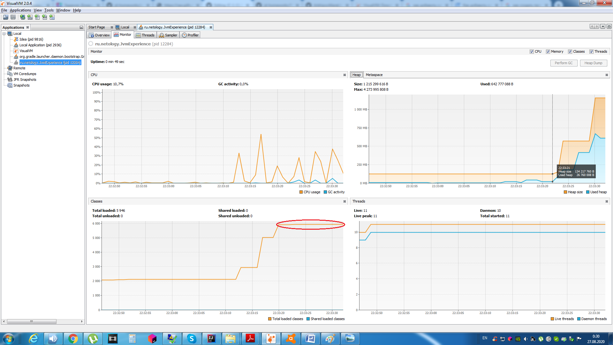
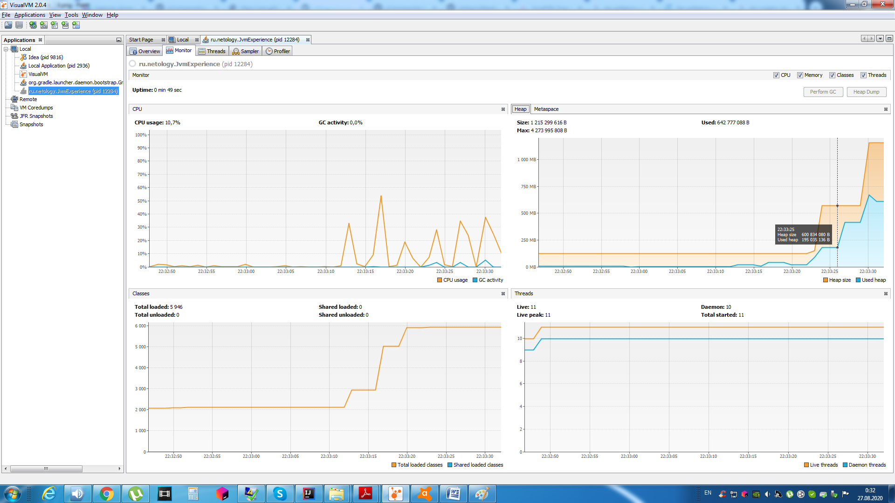
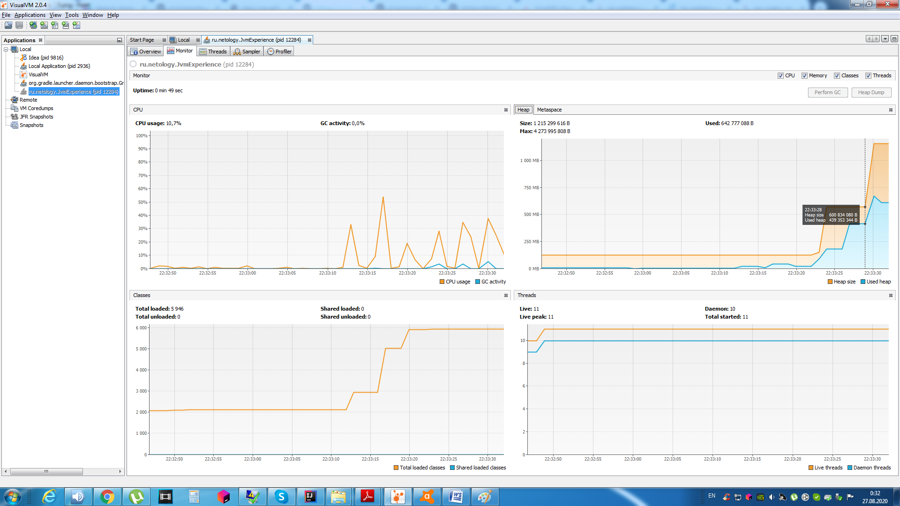

# Описание процесса работы программы
	
## 1 часть 
	
> программа загружает новые классы библиотек! - io.vertx, io.netty, org.springframework

_при подгрузке новых классов в Metaspace записываются мета-данные данных классов_
_используется область пямяти Metaspace, Heap пока не заполняется._
	
22:33:12.346672900:  - loading io.vertx
_: loaded 529 classes_

	
22:33:15.726866200: loading io.netty
_: loaded 2117 classes_

	
22:33:19.545084600: loading org.springframework
_: loaded 869 classes_

## 2 часть 
	
> программа создает новые объекты SimpleObject в большом количестве

_при создании нового объекта он записывается в область памяти heap

22:33:22.805271100: _creating 5000000 objects_

22:33:26.157462800: _creating 5000000 objects_

22:33:29.435650300: _creating 5000000 objects_

